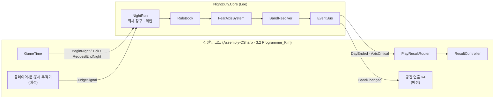
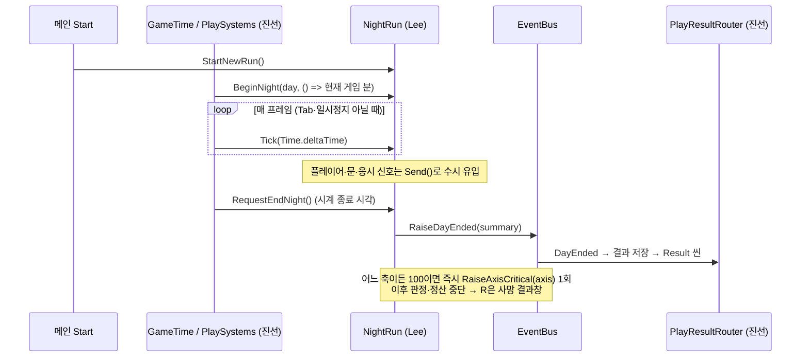

# 판정 코어 ↔ 게임 플로우 연결 약속 (초안)

> 작성: 2026-09-17 · 작성: Programmer_Lee(시스템) · 받는 사람: 진선(클라이언트)
> 상태: **초안 — 합의 전.** 2026-09-17 저녁 갱신: §3 `NightRun`과 §6 `DaySummary` 확장, 복도 카드 H1~H6과 임시 편성표를 **구현했습니다**(Lee 브랜치, 테스트 74개 통과). 이름·동작은 합의에 따라 바꿀 수 있습니다.
> 2026-09-17 밤 갱신: 교실·과학실·화장실 카드 18장, 씬 대상 표식(`JudgeTarget`)과 등록부, 밤 시작/종료 신호, 판정 디버그 패널을 구현했습니다(테스트 215개 통과). **§4.1 순서 규칙과 §4.2 `ClueDelivered`·`InspectionCompleted` 정의를 고쳤고, §4.5·§9를 새로 넣었습니다.**
> 판정 규칙의 정본은 `야간근무_공간별_지침록_개발명세반영본.html`(2026-09-12)입니다. 이 문서는 **누가 무엇을 언제 부르는지**만 정합니다.

---

## 0. 요약

- 판정 코어(`NightDuty.Core`)가 `Programmer_Lee` 브랜치에 들어갔습니다. 컴파일 에러 0, EditMode 테스트 50개 통과.
- 진선님 게임 플로우(로딩·근무 시계·결과창)와 **연결되는 지점은 4곳**입니다.
  1. 근무 시작·종료, 시간 경과 → **회차 창구 `NightRun`** (제안)
  2. 플레이어·문·응시 등 "무슨 일이 일어났다" → **판정 신호 `JudgeSignal`**
  3. 연출 → 기존 `EventBus.BandChanged` / `ISpacePresenter` (변경 없음)
  4. 결과창 → `EventBus.DayEnded(DaySummary)` (구조 개정 제안)
- 진선님 구현 중 **확정 기획서에서 폐기된 설정을 따르는 부분**이 있어 §2에 정리했습니다. 병합 전에 같이 봐 주세요.

---

## 1. 의존 방향



- 진선님 코드는 Core를 **부를 수 있습니다.** (Assembly-CSharp는 asmdef 어셈블리를 자동 참조)
- Core는 진선님 코드를 **부를 수 없습니다.** 그래서 연결 창구는 Core에 두고, 진선님 쪽이 호출하는 구조입니다.
- 판정 쪽에서 "축이 올랐으니 불을 끈다" 같은 호출은 하지 않습니다. 연출은 항상 이벤트를 받아서 합니다.

---

## 2. 확정 기획서와 어긋난 부분 — 같이 정리할 것

진선님 가이드(2026-09-14) 기준입니다. 진선님 잘못이 아니라, 받으신 설정이 **확정 기획서(09-12) 이전 판**이라 생긴 차이입니다.

| # | 현재 구현 | 확정 기획서 | 제안 |
|---|---|---|---|
| 1 | 각인축: Day 3부터 해당 축 이름만 다른 서체 | 프로파일링·각인축 **폐기** | 결과창에서 각인축 서체 처리 제거. `DaySummary.ImprintAxis`는 호환용으로만 남기고 항상 null |
| 2 | 요약에 「충돌 처리 1/1」 | §0 조항·전화 이벤트 **폐기** → 역설 문자 P1~P4가 대신함 | 기획팀 확인 전까지 숨김. 표시한다면 「역설 문자 결과」로 바꿀지 기획 결정 |
| 3 | 로딩 팁 주의문의 「지침록 §0 발견 설계」 | §0 폐기 | 문구·주석만 정리(동작 영향 없음). 「수치·규칙 힌트 금지」 원칙은 그대로 유효 |
| 4 | 마지막 일차 5 (`GameSession.FinalDay`) | 근무 일수 **미정**. 조우 8장면(S-A 1일차 고정 + 나머지 7개 하루 1개)과 연동 | 기획 결정 대기. 값은 한 곳(`FinalDay`)에만 두기 |
| 5 | 근무 종료 = 시계가 1:00에 도달하면 자동 | 종료 **요청**은 필수 점검 + 오늘 조우(관찰·퇴실)가 끝나야 수락. 문자에는 「근무 종료 기한」이 있음 | 기획 확인 필요 (§7-Q2). 당장은 시계 종료 = 종료 요청으로 보고 연결 |
| 6 | 일차가 바뀌면 축 값 초기화(씬 재로드) | **4축은 회차 내내 누적**, 다음 날 초기화하지 않음 | Lee가 `NightRun`에서 씬 전환 후에도 값 유지 |
| 7 | 위반 시각 목록 요청 | 판정 결과에 시각 없음 | Lee가 추가. 시각은 진선님 `GameTime`이 알려 줌(§3) |
| 8 | 사망 시 원인 축만 전달(`AxisCritical(axis)`) | 종료 원인 = 축 · 카드/문자 ID · 공간을 기록 | `NightRun.Cause`로 조회 가능하게 함. 화면에 카드 ID는 **표시하지 않음** |
| 9 | Tab 처리 방식 미기재 | (기획서 보완안) Tab 중 이동·문/손전등·시계·판정 시간·관련 음원/문 동작 **모두 정지**, 닫으면 재개 | Tab이 `timeScale = 0`인지 알려 주세요. 판정에는 `JudgeSignal.Tab(열림)`을 따로 보내 주셔야 함 |

**그대로 좋은 것:** 결과창에만 수치 노출 · 위반 로그에 규칙 ID 미표시 · 로딩 팁에 규칙 힌트 금지 · `AxisCritical` 구독으로 사망 처리 · `DayEnded` 구독으로 실제 결과 교체.

---

## 3. 회차·하룻밤 연결 — `NightRun` (제안)

회차 동안 살아 있는 정적 창구입니다. 씬이 바뀌어도 축 값과 조우 소비 이력을 유지합니다.

```csharp
namespace NightDuty
{
    public static class NightRun
    {
        // ── 회차 ──
        public static void StartNewRun();                 // 메인 Start → 4축 0, 조우 이력 초기화
        public static int  Day { get; }
        public static IFearAxisReader Axes { get; }       // 연출·디버그용 읽기 전용
        public static bool IsCaptured { get; }            // 어느 축이든 100
        public static TerminationCause Cause { get; }     // 최초 종료 원인(축·카드/문자 ID·공간)

        // ── 하룻밤 ──
        public static void BeginNight(int day, Func<int> clockMinutes);
        //   Play 씬 시작 시. clockMinutes = 게임 시각(분, 0:00 기준). 위반 시각 기록에 씀
        public static void Tick(float judgeSeconds);      // 판정 시간 경과. Tab·일시정지 중에는 호출 금지(또는 0)
        public static void Send(in JudgeSignal signal);   // §4의 판정 신호
        public static bool RequestEndNight();             // 종료 요청. 수락 조건 미충족이면 false
        //   수락 조건(필수 점검 완료 · 오늘 조우 종료)은 기획서 확정 사항. 조우 시스템이 생기기 전까지 임시로 항상 true
        //   수락되면 남은 카드를 덱 순서로 정산 → P형 미도달 정산 → EventBus.RaiseDayEnded(summary)
    }
}
```

### 하룻밤 순서



- **진선님 쪽 변경(예상):** `PlaySystems`가 시작할 때 `BeginNight`, 매 프레임 `Tick`, 종료 시각에 `RequestEndNight`. `PlayResultRouter`의 가짜 데이터 경로는 `DayEnded` 수신으로 대체.
- **사망:** 지금처럼 `EventBus.AxisCritical` 구독 그대로. 원인 상세가 필요하면 `NightRun.Cause`.
- **디버그 메뉴 `Force Death`:** 계속 써도 됩니다. 다만 `NightRun`을 거치지 않으므로 축 값은 안 바뀝니다. 필요하면 Lee가 `NightRun.DebugForceCapture(axis)`를 제공합니다.

---

## 4. 판정 신호 — 누가, 언제, 무엇을 보내나

코드: `Assets/_Game/Scripts/Rules/JudgeSignal.cs` (**이미 있음**). Core는 위치·카메라·물리를 모르므로, **거리 계산과 레이캐스트는 클라이언트가 하고 결과만 보냅니다.**

### 4.1 공통 규칙

- **응시·근접 샘플은 고정 간격 0.1초.** 프레임레이트와 무관하게 0.1초마다 보냅니다.
- **판정 시간은 `NightRun.Tick(경과 초)`로만 넘깁니다.** 매 프레임 호출해도 됩니다. `JudgeSignal.Tick`을 `Send`로 따로 보내지 마세요.
- **Tab이 열려 있는 동안에는 보내지 않습니다.** 대신 열림/닫힘을 `JudgeSignal.Tab(bool)`로 한 번씩 보냅니다.
- **조작 출처 구분.** 플레이어 입력은 `ActionSource.Player`, 연출이 움직인 것은 `ActionSource.Direction`.
- **분위기 효과음·인체모형 효과음은 단서 신호를 보내지 않습니다.** (C-A 타격음 ≠ C3 단서, C-B 칠판음 ≠ C4 단서)
- **같은 순간의 신호 순서:** `NightRun.Tick` → `PassageCompleted` → `ZoneExited` → `InspectionCompleted` → `SpaceExited` 순으로 보냅니다.
  - H3는 통행 구역 이탈을 "되돌아감(취소)"으로 보므로, 통행 완료가 먼저 와야 준수로 처리됩니다.
  - C2·C5·S3·S4·T5는 "점검 없이 퇴실 = 대기로 복귀"이므로, **점검 완료가 공간 이탈보다 먼저** 와야 준수로 처리됩니다.
  - T2(물 내림 12초)는 "정확히 12초에 퇴실 = 실패"이므로, 같은 프레임에서는 **`Tick`을 이동 신호보다 먼저** 부릅니다.
- **`NightBegan`·`NightEndAccepted`는 보내지 않습니다.** 각각 `NightRun.BeginNight`·`NightRun.RequestEndNight`가 판정 안에서 만듭니다.
- **Tab 중에는 단서 음원도 멈춥니다.** 코어는 Tab 중 신호를 버리므로, 음원이 Tab 중에 끝나면 `SequenceEnded`가 사라져 C4가 "끝나지 않은 것"으로 남습니다(동기화 오류).

### 4.2 신호 표

| 신호 | 만드는 쪽 (진선) | 보내는 시점 | 필드 |
|---|---|---|---|
| `DoorCommandAccepted` | 문 (`HingedDoor` 예정) | E 명령이 **수락**된 순간. 사거리 밖이라 무시된 입력은 보내지 않음 | TargetId = 문 ID, Flag = 닫기면 true, Source |
| `DoorCloseCompleted` | 문 | 닫힘 애니메이션 **완료** 순간 (T3가 사용) | TargetId, Source |
| `DoorAutoOpenObserved` | 문 + 응시 추적기 | 연출로 자동 개방되는 **동작 중에** 플레이어가 문을 0.2초 식별했을 때. 처음부터 열린 문·소리만 난 문은 보내지 않음 | TargetId |
| `SpaceEntered` / `SpaceExited` | 플레이어 공간 추적 | **발밑 기준점**이 공간 경계를 넘은 순간. 경계 위에서는 직전 공간 유지. 화장실 칸 밖도 화장실 | Space |
| `ZoneEntered` / `ZoneExited` | 구역 트리거 | 통행·점검·칸 내부·금지 구역 진입/이탈 | TargetId = 구역 ID |
| `PassageCompleted` | 통행 구역 | 통행 완료 지점을 지나 통행 구역을 벗어난 순간 | TargetId = 통행 구역 ID |
| `InspectionCompleted` | 점검 구역 | (기획서 보완안) 점검 구역 **1초 체류 후 공간 이탈**. 복도 단순 통행은 아님. 같은 순간의 `SpaceExited`보다 **먼저** 보냄. 재방문에서 다시 점검하면 다시 보냄. S6의 구역 점검은 이 신호가 아니라 구역 체류 시간 + `ZoneExited`로 판정 | Space (5개 점검 ID) |
| `ClueDelivered` | 오디오 단서 재생기 | **카드의 사건 시작 시점**에 보냄(§4.5). 대부분은 청취 구역 안에서 클립이 끝까지 정상 재생된 순간이지만, **C4는 두 음원이 겹쳐 들리기 시작한 순간, T2는 물 내림이 시작된 순간**, C1은 세 번째 획 끝 | TargetId = 단서 ID |
| `ClueIdentified` | 응시 추적기 | 안전 관찰 지점에서 대상을 화면 중앙에 **0.2초** 확인 | TargetId = 대상 ID |
| `SequenceEnded` | 오디오·연출 시퀀스 | 지정 시퀀스 **전체** 종료 (C4 = 90~99 추가 마찰음까지 포함한 끝) | TargetId = 시퀀스 ID |
| `GazeSample` | 응시 추적기 | **0.1초마다, 대상이 없어도** 보냄 | TargetId = 중앙의 첫 가시 충돌체 ID(없으면 ""), Value = 0.1 |
| `ProximitySample` | 근접 추적기 | 0.1초마다, 가까운 기준점에 대해 | TargetId = 바닥 기준점 ID, Value = **수평** 거리(m) |
| `FlashlightChanged` | 손전등 | 켜짐/꺼짐이 바뀐 순간 | Flag = 켜짐 |
| `ModelObserved` | 응시 추적기 | 인체모형을 **가림 없이 1초** 관찰 | TargetId = 장면 ID (`scene.ha` 형식, §4.4) |
| `TabChanged` | 태블릿 | 열림/닫힘 순간 | Flag = 열림 |

> **중요 — 응시 샘플은 빈 값도 보내야 합니다.** 응시 금지 카드(H2·C3·S4)의 유예 시간과 연속 응시 시간이 이 샘플로 흐릅니다. 대상이 없을 때 안 보내면 유예가 끝나지 않습니다.

### 4.3 응시 판정 기준 (기획서 공통 명세 2절)

- 카메라 중앙의 **첫 가시 충돌체**가 대상입니다. 벽·닫힌 문 뒤는 관통하지 않습니다.
- 대상이 바뀌거나 가려지면 연속 시간이 0이 됩니다. (Core가 처리. 추적기는 매 샘플의 대상만 보내면 됨)
- 「고개를 돌린 각도·짧게 본 행동은 판정하지 않는다」(H2 카드 예외 항목)를 위해 중앙 판정에 여유 각도를 둘지는 **미결**입니다. 약 12°는 Lee 권고값입니다 (§7-Q5).
- `OnBecameInvisible()`은 쓰지 마세요. 씬·그림자 카메라에도 반응해 에디터에서만 오작동합니다.

### 4.4 대상 ID 규칙 (제안)

카드와 무관한 **씬 오브젝트 이름**으로 짓고, 한 오브젝트를 여러 카드가 공유합니다.

```
<공간>.<종류>.<구분>
corridor.door.13      복도 1-3 문
corridor.box          복도 중앙 상자 (H4 기준점)
corridor.passage      복도 통행 구역
cls11.desk.turned     1-1 회전 좌석 묶음
toilet.stall.inner    화장실 안쪽 점검칸
scene.ha              인체모형 장면 H-A (장면 ID도 같은 규칙)
```

- 소문자·숫자·점만 씁니다. 카드 데이터(`RuleSO`)의 대상 ID와 **글자까지 같아야** 합니다.
- 씬에 등록되지 않은 ID를 쓰는 카드는 시작 전 검사에서 **미판정**이 되고 콘솔에 경고가 남습니다(크래시 없음).
- 서수(「세 번째 칸」)는 **(제안)** 입구에서 봤을 때 왼쪽부터 셉니다. 기획 확인 전입니다. 레이아웃을 바꿔 서수가 달라지면 Lee에게 알려 주세요.

### 4.5 신호를 보내기 전 확인할 것 (코어가 모르는 조건)

코어는 "신호가 왔다"만 봅니다. 아래 조건은 **보내는 쪽이 확인한 뒤에만** 신호를 보내야 기획서 판정이 됩니다.

| 카드 | 신호 | 보내기 전 조건 |
|---|---|---|
| C1 | 분필 단서 | 그날 1-3 점검 전, 1-1 문밖 청취 지점, 하루 1회 |
| C2 | 회전 좌석 식별 | 회전 좌석이 실제로 있음(배치 25+ 또는 C-A), 금지 반경 밖 안전 관찰 지점 |
| C3 | 타격음 단서 | 교실 점검 체류(1초)를 마치고 퇴실 준비 구역에 들어섬 |
| C4 | 칠판+의자 단서 | 교탁 반경 밖. 시작 시점은 겹침 시작 |
| C5 | 등 상태 식별 | 실제 켜진 등이 4개 이하. 등 개수와 조도 구간이 다르면 보내지 않고 개발 로그 |
| S2 | 파손음 단서 | S1 최초 관찰 완료, 오늘 조우 선정 완료, 과학실 점검 후 퇴실, 과학실에 미완료 조우 없음 |
| S3 | 접촉음 단서 | 그 방문에서 간격(`science.bench.glass`)을 이미 식별했고 반경 밖 |
| S4 | 마지막 등 식별 | 실제 켜진 등이 1개 |
| T2 | 물 내림 단서 | 현재 위치에서 12초 안에 출구 도달 가능. 시작 시점은 물 내림 시작 |
| T4 | 호출 단서 | 세면대 반경 밖, 물 흐름 없는 수도꼭지가 보임 |
| T5 | 새는 빛 식별 | 닫힌 칸 아래 빛이 실제로 있음 |
| T6 | 두 칸 개방 식별 | 두 칸이 실제로 열림, T1 활성 날이 아님 |

**모형·역설 방문에서 보내지 않을 신호**

| 방문 | 보내지 않을 카드 신호 |
|---|---|
| C-A | C3 타격음(효과음), C4 단서, C5 등 식별 |
| C-B | C4 칠판·의자(효과음), C3, C5 |
| 일반 S-B | S2 파손음, **S4 마지막 등 식별**, S6 구역 진입(카드용) — S5만 새로 시작해야 함 |
| P1 경유 S-B | 장면 ID를 `scene.sb` 대신 **`scene.sb.p1`**로 보냄(S5 미시작), S4·S6 카드용 신호 |
| T-A | T2 물 내림, T4 호출, T5 빛 식별, **T6 두 칸 개방 식별**(장기 카드라 코어가 막지 못함) |
| T-B | T2, T4(숨소리는 효과음), T5 |

---

## 5. 연출이 받는 것 — 변경 없음

- `EventBus.BandChanged(space, axis, from, to)` / `EventBus.BandProgress(space, axis, t01)`
  - **청각·조도·배치만** 옵니다. 신뢰는 월드에 그리지 않으므로 오지 않습니다.
  - `from == to`가 옵니다. `NightRun.BeginNight`가 씬 시작 때 기준값을 한 번 방송합니다(제안). **연출은 여러 번 받아도 같은 결과여야 합니다.**
  - 진행 중인 사건이 있는 공간은 사건이 끝날 때까지 변화가 미뤄져서 옵니다.
  - `OnDisable`에서 반드시 구독 해제. `EventBus.ClearAll()` 훅은 지우지 마세요.
- `ISpacePresenter` (`Space`, `OnBandChanged`, `OnBandProgress`, `ResetForNewDay`) 그대로.
- `EventBus.DayStarted(int, ClauseZeroType)`의 `ClauseZeroType` 인자는 폐기된 §0 개념이라 **폐기 예정**입니다. 새로 구독하지 마세요.
- 등 개수는 `BandTableSO.LitCountFor(space, band)`. Band4는 **전 공간 0개 + 붉은 잔광**으로 바뀌었습니다(과학실 예외 폐기).
- 구간: 0–24 / 25–49 / 50–74 / 75–89 / 90–99. 100은 구간이 아니라 종료입니다.
- 조도 라이트는 Point/Spot + **Realtime**. 벤더 데모씬의 Area Light는 실시간 토글이 안 됩니다.

---

## 6. 결과창 데이터 — `DaySummary` 개정 (제안)

진선님 결과창이 읽는 구조라 **병합 시 깨지지 않게 기존 필드와 기존 11인자 생성자는 그대로 두고**, 새 필드는 새 생성자(오버로드)로만 채웁니다.

| 필드 | 지금 | 개정 후 |
|---|---|---|
| `Day`, 4축 값, `AxisValue()` | 있음 | 그대로 |
| `PatrolDone / PatrolTotal` | 방문 수 | 그날 **점검 완료** 수 / 5 |
| `Violations` | 위반 수 | 그대로 (그날 위반으로 정산된 카드 수) |
| `ConflictsHandled / ConflictsTotal` | §0 충돌 | 폐기 예정 표시. §7-Q3 결정 전까지 0 |
| `ImprintAxis` | 각인축 | 폐기 예정 표시. 항상 null |
| `ViolationMinutes` | 없음 | **추가** — 위반 시각(게임 분) 목록. 결과창은 이 값만 표시 |
| `Outcome` | 없음 | **추가** — 근무 종료 / 포획 |
| `Cause` | 없음 | **추가** — 포획 시 종료 원인. 화면에는 축 정도만(카드 ID 표시 금지) |
| `Results` | 없음 | **추가** — 카드별 결과(개발 로그·리뷰용). 화면 표시용 아님 |

- 위반 로그에는 지금처럼 **시각만** 표시하고 규칙 ID·내용은 쓰지 않습니다.
- 진선님 `DayResult`(요약 + 종료 방식 + 위반 시각)는 개정 후 `DaySummary` 하나로 합칠 수 있습니다. 합칠지는 진선님이 정해 주세요.

---

## 7. 결정이 필요한 질문

| # | 질문 | 누구 | 영향 |
|---|---|---|---|
| Q1 | 근무 일수는 며칠인가? (조우 8장면 소비와 연동) | 기획팀 | `FinalDay`, 조우 배정 |
| Q2 | 근무 종료는 시계 마감 자동인가, 플레이어의 종료 요청인가, 둘 다인가? 요청 방식은? | 기획팀 | `RequestEndNight` 수락 조건, 문자 기한 |
| Q3 | 결과창에 역설 문자 결과(충돌 처리 자리)를 보여 주나? | 기획팀 | `ConflictsHandled` 대체 여부 |
| Q4 | 신뢰 100 포획 엔딩 연출은? | 기획팀 | 사망 결과창 분기 |
| Q5 | 응시 판정에 여유 각도(약 12°)를 두나? | 기획팀·진선 | 응시 추적기 구현 |
| Q6 | Tab은 `timeScale = 0`으로 멈추나? | 진선 | `Tick` 호출 방식 |
| Q7 | §4.4 대상 ID 규칙으로 가도 되나? | 진선 | 카드 데이터 작성 |
| Q8 | GameFlow 코드를 `Assets/_Game/`으로 옮길 계획이 있나? (공유 코드는 `_Game`이 규약. 나중에 옮기면 프리팹 참조가 깨짐) | 진선 | 폴더 정리 시점 |
| Q9 | 복도 통행 구역에 들어가는 순간 H3가 시작되어 그 방문의 「신규 단기 사건 1개」 몫을 차지합니다. 같은 방문에서 H1(자동 개방)·H2·H5·H6는 시작되지 않습니다. 의도인가, 아니면 H3가 진행 중인 방문에는 다른 단서를 내지 않도록 편성할까? | 기획팀 | 편성·연출 순서 |

---

## 8. 병합 체크리스트 (2026-09-18 예정)

1. `git lfs locks` 확인 — 씬·프리팹 잠금 충돌 여부
2. `origin/Programmer_Jinsun` → `Programmer_Lee` 병합
   - 겹칠 가능성이 있는 파일: `HUDActions.cs`(진선님 수정본 채택), `Packages/manifest.json`·`packages-lock.json`(Lee 쪽 `com.unity.pipeline` 로컬 변경 — 커밋 여부 합의), `ProjectSettings/EditorBuildSettings.asset`(진선님 씬 등록 채택)
3. Unity에서 컴파일 에러 0 확인 → EditMode 테스트 215개 + 진선님 로직 테스트 실행
4. Main → Loading → testScene → 결과창 흐름이 병합 후에도 그대로 도는지 확인 (진선님 가이드 Part 3 순서)
5. 이 문서 §2·§3·§6 합의 → Lee가 `NightRun`·`DaySummary` 개정 구현 → 진선님이 `PlaySystems`·`PlayResultRouter` 연결

---

## 9. 2026-09-17 밤 추가 구현 (Lee)

- **씬 대상 표식 `JudgeTarget`** (`_Game/Scripts/Direction/`): 오브젝트에 붙이고 ID를 적으면 켜질 때 등록부(`JudgeTargetRegistry`)에 올라갑니다. `NightRun.BeginNight`이 그 순간 켜진 표식으로 카드 참조를 검사합니다(표식이 하나도 없으면 검사 생략). 응시 레이캐스트는 `JudgeTarget.IdOf(hit.collider)`로 ID를 얻습니다. 메뉴 `NightDuty ▸ 씬 대상 검사`로 열린 씬과 편성표를 대조합니다.
- **밤 시작/종료 신호**: `NightBegan`(71)으로 밤 시작부터 감시하는 장기 카드(C6)를 시작하고, 밤 종료 때 진행 중 카드에 `NightEndAccepted`를 전달합니다(“종료 때 의무가 남았으면 위반”).
- **새 조건**: `BeforeCondition`(“가드보다 먼저 일어남” — T3·C6), `DoorObligationCondition`(직접 연 문 장부 — C6). 준수 전용 카드(S1, 위반 없음) 허용.
- **카드 18장** `ScriptableObjects/Rules/Classroom|Science|Toilet`, 메뉴 `NightDuty ▸ 모든 공간 카드 에셋 생성`. 임시 편성표는 1일차 복도, 2일차 교실, 3일차 과학실, 4일차 화장실(**디버그 편성** — S1 1일차 고정, T1·T3 같은 날 금지 규칙은 DayDirector 몫).
- **대상 ID 추가** (§4.4 규칙):
```
cls11.chalk3 · cls11.desk.turned · cls11.desk.back · cls11.lectern · cls11.lectern.noise · cls11.lights · cls13.lights
corridor.door.11 (1-1 문, 신규) · corridor.door.13
science.model.sa.face · science.glass.break · science.bench.glass · science.bench.glass.clink · science.light.last
science.model.sb · science.zone.glass
toilet.stall.outer · toilet.stall.inner · toilet.stall.outer.inside · toilet.stall.inner.inside
toilet.flush · toilet.sink · toilet.sink.call · toilet.stall.light · toilet.stalls.bothopen
scene.sa · scene.sb · scene.sb.p1 · scene.ta · scene.tb · scene.ca · scene.cb
```
- **남은 질문 (기획)**: C1을 장기로 둬도 되나(단기면 H3와 같은 방문에서 하루 1회 단서가 버려짐) / C6 1-1 문이 H1의 자동 개방 문과 같은가 / T6 준수는 T6 시작 뒤 점검만 인정하나 / C2·T6 "또는" 자격을 단서 존재로 대신해도 되나 / 동선 봉쇄 시 C6 면제 방법 / C5를 1-3에서 진행할 때 구간 보류가 1-1에 걸리는 한계.
